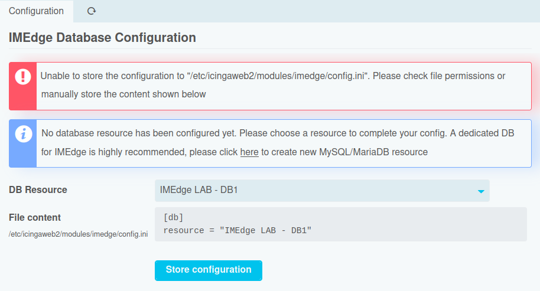

Configuration
=============

Database Setup
--------------

The IMEdge module needs a MySQL/MariaDB database for its central Inventory database.
When a User without administration permissions tries to access IMEdge before its DB
has been configured, he will be presented an error message:

An Administrator is presented with a related configuration form, allowing him to
complete the setup:

Once done, a related success message is being shown:

### Troubleshooting

#### Wrong connection encoding

The IMEdge DB must be configured with real UTF8 encoding, such being `utf8mb4`
in MySQL/MariaDB. In case your resource configuration does no reflect this, a
related error message is being shown:

Please correct your DB resource configuration in Icinga Web or manually add `charset = utf8mb4`
in your `resources.ini`.

#### Insufficient file permissions

Usually, Icinga Web should be able to write configuration files in `/etc/icingaweb2`.
However, administrators might opt for a more restrictive setup, use centralized
automation tools and restrict write access to the configuration. In such case,
IMEdge complains accordingly:

Please pick the shown configuration and store it to the related configuration
file as explained in the error message.

#### Database connection failure - Access denied

In case your Icinga Web installation is unable to connect to your database with
the given credentials, a related connection error is being shown:

Please double-check your credentials and granted DB permissions.

#### Database connection failure - No Route

The error message might contain a hint such as "No route to host":

In this case please check your configured DB hostname or IP address and your
related firewall rules.

#### Database connection failure - Connection refused

The error message might complain about a refused connection with "Connection refused":

In this case please check your configured DB port number, your related firewall
rules, and whether your DB server is listening on that configured port.
